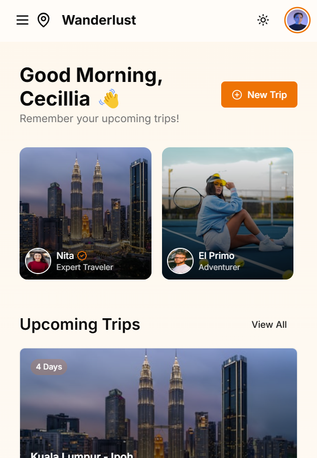

# Wanderlust - Travel Community Platform



A modern travel community platform built with Next.js, where travelers can explore destinations, plan trips, and connect with fellow adventurers.

## Features

- **Explore Destinations**: Browse through curated travel destinations with detailed information, ratings, and reviews
- **Trip Planning**: Create and manage your travel itineraries with an intuitive planning interface
- **Community Interaction**: Connect with other travelers, share experiences, and follow their journeys
- **Interactive Maps**: View friend locations and discover nearby attractions
- **Responsive Design**: Fully optimized for all devices with a beautiful, modern interface
- **Dark Mode Support**: Toggle between light and dark themes for comfortable viewing

## Tech Stack

- **Framework**: Next.js 13 with App Router
- **Styling**: Tailwind CSS
- **UI Components**: shadcn/ui
- **Icons**: Lucide React
- **Theme**: next-themes
- **Type Safety**: TypeScript

## Getting Started

1. Clone the repository:
```bash
git clone https://github.com/yourusername/wanderlust.git
```

2. Install dependencies:
```bash
cd wanderlust
npm install
```

3. Start the development server:
```bash
npm run dev
```

4. Open [http://localhost:3000](http://localhost:3000) in your browser

## Project Structure

- `/app` - Next.js 13 app directory containing all routes and pages
- `/components` - Reusable UI components
- `/lib` - Utility functions and shared logic
- `/public` - Static assets
- `/styles` - Global styles and Tailwind CSS configuration

## Key Features Breakdown

### Destination Exploration
- Search functionality with filters
- Detailed place pages with descriptions and essential information
- Tag-based navigation
- Rating and review system

### Trip Planning
- Interactive trip creation interface
- Activity scheduling
- Budget tracking
- Duration management

### Social Features
- User profiles
- Friend location tracking
- Travel history sharing
- Community engagement tools

## Contributing

Contributions are welcome! Please feel free to submit a Pull Request.

## License

This project is licensed under the MIT License - see the [LICENSE](LICENSE) file for details.